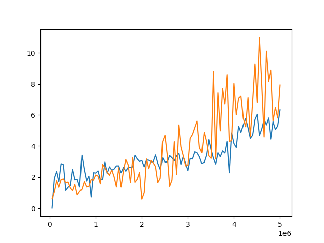
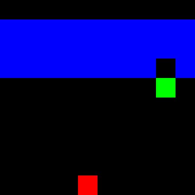
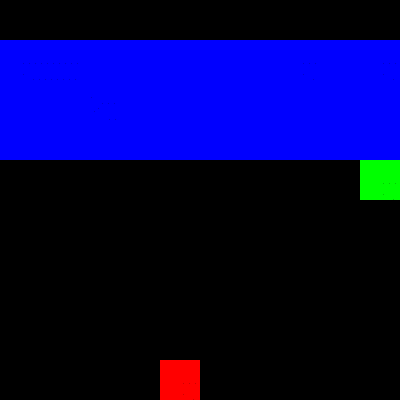

# dreamerV2

強化学習オータムセミナー2021(https://deeplearning.jp/drl-course-2021a/) 
最終課題プロジェクト 
DreamerV2(https://ai.googleblog.com/2021/02/mastering-atari-with-discrete-world.html )
でMinAtar breakout環境の学習

## 学習の様子

(横軸がステップ数、縦軸がエピソード収益、橙線がDreamerV2,青線がDDQN)

## 真のフレームとモデル上の未来予測との比較

# 参考
https://github.com/RajGhugare19/dreamerv2
